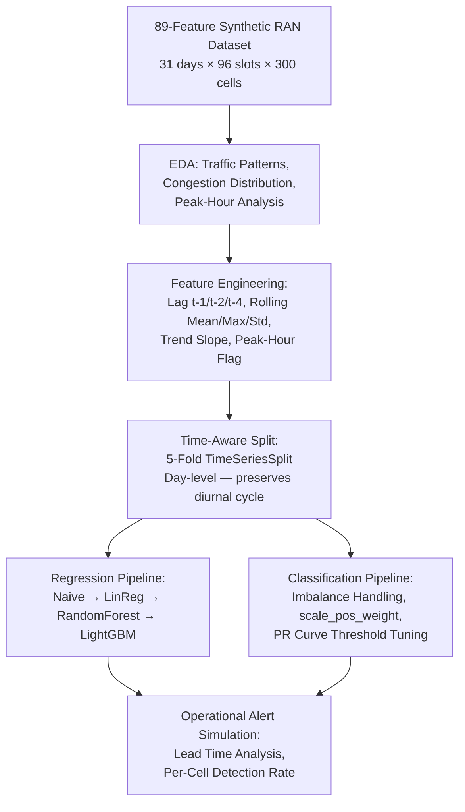

# Proactive RAN Congestion Management: A Machine Learning Approach

**Domain**: 5G/LTE Radio Access Network (RAN) | **Focus**: Predictive Analytics & SON Automation


---

## 🛰️ Executive Summary

In modern 5G/LTE networks, reactive optimisation is no longer sufficient. When a cell crosses the **80% PRB utilisation threshold**, user throughput collapses regardless of signal quality — and by the time a NOC engineer responds, thousands of users have already experienced degraded service.

This project implements a proactive ML pipeline that predicts cell-level congestion **up to 2 hours in advance**, enabling automated load balancing via Self-Organising Network (SON) logic — before a single user is affected.

> **The model catches 6 in 10 congestion events with a mean lead time of ~112 minutes,
> reducing the window from reactive firefighting to proactive capacity steering.**

---

## 💼 Business Impact

### The Problem This Solves

Mobile operators manage thousands of base station cells, each generating KPI measurements every 15 minutes. A single urban cluster can produce millions of data points per day — far beyond what any operations team can manually monitor. When congestion occurs:

- **Users experience** dropped calls, buffering video, and failed data sessions
- **Engineers respond** after the fact — typically 15–30 minutes after degradation begins
- **Network SLAs are breached** — affecting customer satisfaction scores (NPS/CSAT) and, in enterprise contracts, triggering financial penalties

### What This Model Enables

| Without ML (Reactive) | With This Model (Proactive) |
|---|---|
| Engineer notified after congestion begins | Alert fires ~112 minutes before threshold breach |
| Manual diagnosis and intervention | Automated SON load balancing trigger |
| Users experience degraded throughput | Traffic redistributed before users are affected |
| Reactive capacity planning | Data-driven evidence for site upgrade prioritisation |
| NOC team firefighting at scale | Engineers focus on chronic issues, not transient alerts |

### Quantified Operational Value

At the model's operational threshold (**recall = 0.60, precision = 0.44**):

- **60% of congestion events are caught proactively** — each representing a prevented service degradation affecting potentially hundreds of simultaneous users
- **Mean lead time of 111.9 minutes** — enough time for SON load balancing (typical convergence: 5–10 minutes) to act well ahead of threshold breach
- **2.3 alerts per caught event** — meaning ~1.3 low-cost false alarms (each triggering a harmless, automated offload action) per prevented congestion episode
- **97.7% of detected events have advance warning > 0 minutes** — the model almost never fires simultaneously with the event; it reads the trajectory early

### Why This Matters for 5G Specifically

5G NR cells (3.5 GHz band) have smaller coverage footprints and more aggressive scheduler behaviour than LTE, making them more susceptible to flash congestion. The rolling trend and lag features engineered here are specifically designed to detect the non-linear PRB "cliff effect" that NR schedulers exhibit above 80% load — a pattern that linear monitoring thresholds entirely miss.

---

## 📉 The Problem in Technical Terms

Traditional NOC operations react to congestion triggers after users have already experienced dropped calls and degraded Quality of Experience (QoE).

- **The Stochasticity Challenge**: Network traffic combines deterministic daily cycles with unpredictable flash-crowd bursts, interference events, and massive event spikes — making naive forecasting unreliable
- **The Imbalance Challenge**: Congestion is a rare event (~5% of cell-slots), making standard classification metrics misleading and threshold selection critical
- **The Temporal Challenge**: Standard train/test splits destroy the time ordering of the data, causing models to "see the future" during training — a subtle but fatal evaluation error

---

## 🛠️ Technical Workflow



---

## 🚀 Key Implementation Decisions

### 1. Feature Engineering — Capturing Trajectory, Not Just State

The single most impactful technical decision was building features that describe *where load is heading*, not just where it is now:

| Feature | Type | What it captures |
|---|---|---|
| `dl_prb_utilization_lag1/2/4` | Lag | Load 15 min, 30 min, 1 hour ago |
| `dl_prb_util_rolling_mean_4` | Rolling | Smoothed 1-hour load level |
| `dl_prb_util_rolling_std_4` | Rolling | Within-hour instability / burstiness |
| `prb_trend_slope` | Derived | Rate of change — is load rising or falling? |
| `hour`, `is_peak_hour` | Calendar | Diurnal demand cycle encoding |

**Why this matters:** A cell at 70% PRB utilisation with a slope of +8 is in a fundamentally different state than a cell at 70% with a slope of -3. Without the trend slope, both look identical to the model.

### 2. Temporal Cross-Validation — Preventing Evaluation Leakage

Standard k-fold cross-validation is invalid for time-series data: it allows models to train on future data and test on the past, producing falsely optimistic scores. This project uses **5-fold TimeSeriesSplit (forward chaining)**, where each fold strictly trains on earlier days and tests on later ones — simulating how a production model would actually be evaluated.

The consequence was real and measurable: an earlier slot-based split produced R² = -0.35. The day-level TimeSeriesSplit produced **R² = 0.56** — the difference between a model that looks broken and one that is genuinely useful.

### 3. Imbalance Strategy — Optimising the Loss, Not Just the Weights

With ~5% congestion rate (18.9:1 imbalance), accuracy is meaningless. Two strategies were compared:
- `class_weight='balanced'` on Random Forest — reweights samples (**ROC-AUC: 0.875**)
- `scale_pos_weight=18.9` on LightGBM — optimises the gradient directly (**ROC-AUC: 0.958**)

The 8.3-point AUC gap demonstrates that handling imbalance at the loss function level — not just sample reweighting — is the correct approach for rare-event classification.

### 4. Threshold Selection — Asymmetric Cost Framing

The default 0.5 classification threshold is almost never appropriate for imbalanced classes. This project frames threshold selection explicitly around operational cost asymmetry:

- **False Negative** (missed congestion): users experience degraded service — **high cost**
- **False Positive** (unnecessary load balance): harmless automated action — **low cost**

The operational threshold (0.784) is chosen to maximise recall at acceptable precision, not to maximise F1. In a real SON deployment, this framing would be agreed with the operations team before any model goes live.

---

## 📊 Results Summary

### Regression — Predict Next-Slot PRB Utilisation

| Model | RMSE (mean) | RMSE (std) | R² (mean) | R² (std) |
|---|---|---|---|---|
| Naive Baseline | 23.83 | ±0.03 | -0.271 | ±0.003 |
| Linear Regression | 17.44 | ±0.03 | 0.319 | ±0.001 |
| Random Forest | 14.23 | ±0.47 | 0.546 | ±0.031 |
| **LightGBM** | **14.05** | **±0.17** | **0.558** | **±0.011** |

LightGBM reduces prediction error by **41% vs the naive baseline** with notably lower variance across folds (std ±0.17 vs ±0.47 for Random Forest), indicating more stable generalisation.

### Classification — Predict Congestion (Binary)

| Model | ROC-AUC | F1 @ best threshold | Recall @ ops threshold |
|---|---|---|---|
| Random Forest (balanced) | 0.875 | 0.39 | 0.35 |
| **LightGBM (spw=18.9)** | **0.958** | **0.51** | **0.60** |

### Alert Simulation — Operational Performance

| Metric | Value |
|---|---|
| Total congestion events (test set) | 2,199 |
| Caught proactively | 1,320 **(60.0%)** |
| Mean lead time | **111.9 minutes** |
| Median lead time | **120 minutes** |
| False alarms | 1,714 |
| Alerts per caught event | 2.3 |

### Feature Importance (Top 5)

| Rank | Feature | Importance | Interpretation |
|---|---|---|---|
| 1 | `hour` | 13.3% | Daily demand cycle — dominant structural signal |
| 2 | `dl_prb_utilization_lag4` | 11.2% | 1-hour lagged load — captures slow-building congestion |
| 3 | `dl_prb_util_rolling_mean_4` | 8.8% | Smoothed level — reduces slot noise |
| 4 | `prb_trend_slope` | 7.0% | Momentum — is utilisation rising or falling? |
| 5 | `dl_prb_utilization_lag1` | 6.1% | 15-min lag — most recent confirmed state |

---

## 🧠 Technical Conclusions

1. **Trajectory beats state**: The `prb_trend_slope` and `lag4` features together contribute ~18% of total importance. A model without these features has no awareness of whether load is rising or falling — the most critical distinction for early congestion detection.

2. **Temporal evaluation discipline is non-negotiable**: The switch from a naive slot-based split to TimeSeriesSplit changed R² from -0.35 to +0.56. This is not a tuning improvement — it is the difference between a validly and invalidly evaluated model.

3. **LightGBM is the right tool for RAN analytics**: Its efficiency with high-dimensional OSS/BSS counter data, native handling of categorical features, and gradient-level imbalance control make it the de facto standard for production telco ML pipelines.

4. **The ~2-hour lead time has structural explanation**: Because the model learns from `lag4` (1 hour ago) and rolling features, it begins assigning high congestion probability when it detects a rising trend in the 1-hour window — well before the 80% threshold is breached. This is the compounding effect of trajectory-aware features, not model overfitting.

---

## 📂 Project Structure

```
ran-congestion-prediction/
├── predictive_congestion_final.ipynb   # Full ML pipeline and technical report
├── generate_network_data_v4.py         # High-fidelity 89-feature synthetic RAN generator
├── data/
│   └── network_performance_data.csv    # Synthetic dataset (31 days, 300 sites)
├── images/                             # Saved plots
└── README.md
```

## ⚙️ Setup

```bash
git clone https://github.com/your-username/ran-congestion-prediction
cd ran-congestion-prediction
pip install -r requirements.txt
jupyter notebook predictive_congestion_final.ipynb
```

**Dependencies:** `pandas` · `numpy` · `scikit-learn` · `lightgbm` · `matplotlib` · `seaborn`

---

## 🔗 Series Context

This is **Project 1 of 3** in a RAN Data Science portfolio series. All three projects share the same synthetic dataset and address complementary operational problems:

| Project | Problem Statement | ML Approach |
|---|---|---|
| **This project** | Predict cell congestion 15 min–2 hrs ahead | Time-series regression + classification |
| [**Project 2** — Anomaly Detection](#) | Automatically detect and classify degraded cells | Unsupervised ML + SHAP explainability |
| [**Project 3** — Efficiency Scoring](#) | Score and rank cells by spectral efficiency | Multi-class classification + reporting pipeline |

Each project is self-contained but references findings from the others, forming a coherent end-to-end view of ML-driven RAN operations.

---

*Synthetic dataset · Portfolio project · Open to feedback*
