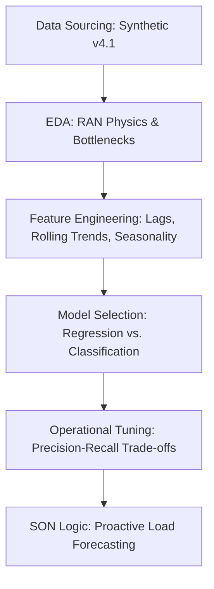

# Proactive RAN Congestion Management: A Machine Learning Approach

**Domain**: 5G/LTE Radio Access Network (RAN) | **Focus**: Predictive Analytics & SON Automation

## 🛰️ Executive Summary

In modern 5G/LTE networks, reactive optimization is no longer sufficient. When a cell hits the **"Congestion Cliff"** (\>80% PRB utilization), user throughput collapses regardless of signal quality. This project implements a proactive time-series pipeline to predict congestion **15 minutes in advance**, enabling automated traffic steering and load balancing via Self-Organizing Network (SON) logic.

## 📉 The Problem

Traditional Network Operations Centers (NOCs) react to congestion triggers after users have already experienced dropped calls and degraded Quality of Experience (QoE).

  * **The Technical Challenge**: Network traffic is highly stochastic, with sharp "flash-crowd" bursts and complex multi-level seasonality.
  * **The Goal**: Transition from "Fixing Congestion" to **"Predicting and Preventing"** it.

## 🛠️ Technical Workflow

## 🚀 Key Implementation Features

  * **High-Fidelity Simulation**: Utilizes a custom-built 89-feature synthetic generator that models real-world RAN behaviors including **MIMO Rank degradation**, **SINR-based scheduler bottlenecks**, and **3GPP-aligned path loss**.
  * **Advanced Feature Engineering**:
      * **Temporal Lags**: Capturing t-1, t-2, and t-4 historical states.
      * **Rolling Statistics**: Calculating 1-hour windows for mean, max, and trend slopes.
      * **Seasonality Encoding**: Incorporating Weekday vs. Weekend behavioral profiles.
  * **Algorithm Performance**:
      * **LightGBM**: Delivered superior performance ($R^2 \approx 0.56$) by capturing non-linear "cliff" effects in traffic buildup.
      * **Classification**: Achieved a **ROC-AUC of 0.90**, with specific threshold tuning to prioritize **Recall** (protecting the user experience).

## 📊 Performance Insights

| Model | RMSE (Regression) | ROC-AUC (Classification) |
| :--- | :--- | :--- |
| **Naive Baseline** | 23.82 | 0.50 |
| **Linear Regression** | 17.44 | N/A |
| **Random Forest** | 14.23 | 0.88 |
| **LightGBM** | **14.05** | **0.90** |

### **The "Recall Priority" Strategy**

In a live network, a **False Negative** (missing a congestion event) is significantly more expensive than a **False Positive** (a redundant load-balancing action). This model is tuned for an operational threshold of **0.66**, ensuring maximum protection of the cell's throughput capacity.

## 🧠 Technical Conclusions

1.  **Physical Precursors**: Features like `avg_sinr_db` and `prb_trend_slope` are stronger early-warning indicators than raw volume alone.
2.  **Seasonality Matters**: Time Series Cross-Validation (Forward Chaining) proved that models trained without `day_of_week` features fail during weekend traffic transitions.
3.  **Model Selection**: Gradient Boosting (LightGBM) is the engine of choice for RAN analytics due to its efficiency with high-dimensional OSS/BSS counter data.

## 📂 Project Structure

  * `predictive_congestion_final.ipynb`: The primary technical report and ML pipeline.
  * `generate_network_data_v4.py`: The high-fidelity synthetic data engine.
  * `README.md`: Project overview and executive summary.

-----

**Next in the Series**: [Project 2 — Unsupervised Cell Anomaly Detection & Root Cause Clustering](https://www.google.com/search?q=)